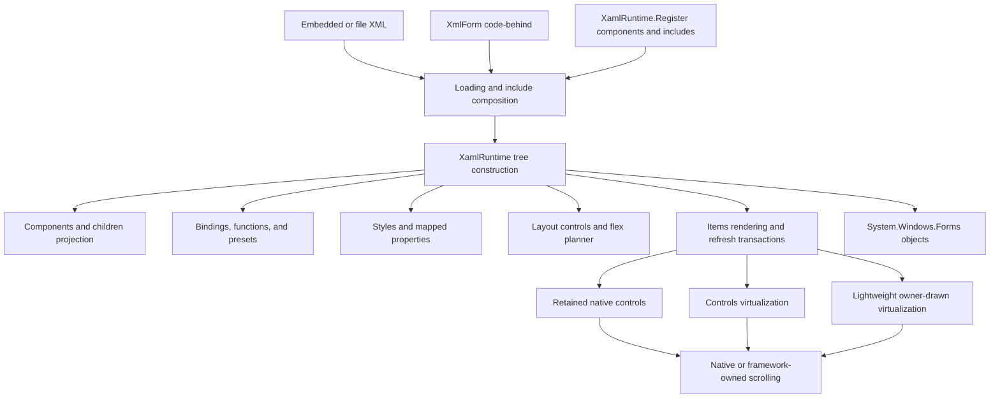
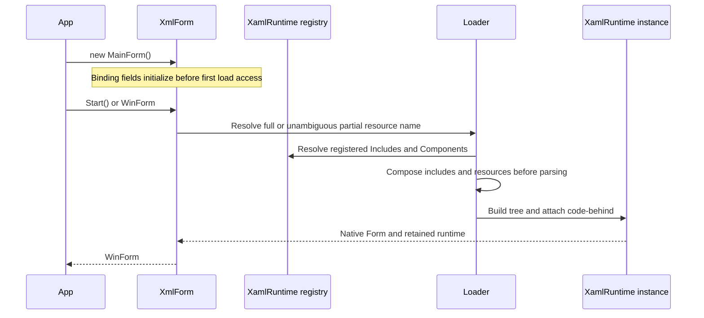
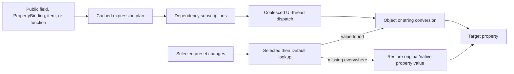
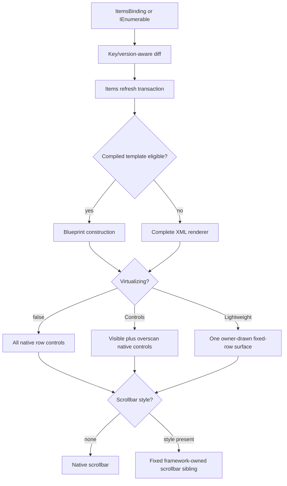

# WinFormsXaml agent guide

This file applies to the complete repository. A more specific `AGENTS.md` in a
subdirectory may add narrower instructions for that subtree.

## Mission

WinFormsXaml turns XML into ordinary Windows Forms control trees while keeping
the shipping runtime compatible with C# 2.0 and the .NET Framework 2.0 API
surface. The framework should feel convenient like XAML without hiding normal
WinForms objects, ownership, events, or platform behavior.

Optimize for, in order:

1. Correct and diagnosable behavior.
2. Compatibility with the declared C# 2.0/.NET 2.0 surface.
3. Smooth UI behavior, bounded resource use, and fast startup.
4. A small, readable, modular runtime.
5. Simple authoring, documentation, and XML IntelliSense.

Do not trade correctness or maintainability for a benchmark-only shortcut.

## Non-negotiable contracts

- The public namespace and package identity are `WinFormsXaml`. Do not restore
  former product namespaces or require a namespace-alias workaround.
- Use Form terminology. The code-behind convenience property is
  `XmlForm.WinForm`; do not introduce a public `Window` synonym.
- Runtime source under `src/WinFormsXaml` must compile as C# 2.0 and reference
  only .NET Framework 2.0 APIs.
- Native WinForms behavior is the default. Framework rendering is used for
  explicit styling or for a capability fallback, not merely because the host
  operating system is old.
- `ItemsControl.AutoScroll` defaults to `true`. `SmoothScroll` and
  virtualization default to `false` and are always explicit.
- Missing binding members and invalid markup must produce a contextual error;
  do not make a broken item silently disappear.
- Preset lookup is selected preset, then that preset group's declared default.
  If a key is absent from both, the bound property is not assigned; a property
  previously owned by that preset binding must be reset to its original/native
  value. Never retain a dark-only value after switching to a light preset.
- Preserve ordinary WinForms ownership. Runtime-owned controls, subscriptions,
  images, icons, fonts, timers, threads, and helper objects must be released by
  `Dispose` without double-disposing application-owned values.
- XML is trusted application code, not safe user data. DTDs and external entity
  resolution remain disabled, but markup may instantiate types, access files,
  and bind methods. Never advertise untrusted XML loading as safe.
- Do not run or claim Windows 98 guest acceptance unless the user explicitly
  asks for it. Wine, Mono, a .NET 2 reference compile, and modern Windows are
  distinct evidence levels.
- Never push Git commits, publish a NuGet package, create a release, or deploy
  on the user's behalf without explicit approval for that external action.

## Language and platform rules

Allowed runtime language features include normal C# 2.0 classes, partial
classes, generics, delegates, and anonymous methods. Do not use later features
such as `var`, lambdas, LINQ, extension methods, object initializers,
auto-properties, `async`/`await`, interpolated strings, `nameof`, pattern
matching, tuples, records, nullable annotations, or expression-bodied members.

Do not use APIs added after .NET Framework 2.0. In particular, avoid Tasks,
concurrent collections, modern reflection helpers, newer drawing/control APIs,
and framework-specific conveniences that happen to compile against the
developer machine. The validation projects intentionally compile with
`LangVersion=2`, warnings as errors, and Microsoft net20 reference assemblies.

The shipping library is Any CPU and depends only on `System`, `System.Data`,
`System.Drawing`, `System.Windows.Forms`, and `System.Xml`.

## Architecture



The main runtime is one `partial` type split by responsibility. That is
intentional: subsystem state remains private while individual files stay
understandable. Do not merge it into a monolith, and do not split every small
helper into its own file.

### Repository map

| Path | Responsibility |
| --- | --- |
| `src/WinFormsXaml` | Shipping runtime and public API. |
| `src/WinFormsXaml/Loading` | `XmlForm`, embedded-resource discovery, includes, XML documents, and load diagnostics. |
| `src/WinFormsXaml/Binding` | Binding parsing, subscriptions, source updates, functions, presets, `PropertyBinding<T>`, and `ItemsBinding<T>`. |
| `src/WinFormsXaml/Components` | Component/include registration, code-behind construction, lifetime, and `<Children/>` projection. |
| `src/WinFormsXaml/Controls` | Framework controls: ItemsControl, scrollbars, TabView, Image, HyperlinkLabel, progress compatibility, and layout primitives. |
| `src/WinFormsXaml/Layout` | General layout, Flex, and ItemsControl geometry. |
| `src/WinFormsXaml/Rendering` | Item templates, compiled blueprints, transactions, reactive patches, and cleanup. |
| `src/WinFormsXaml/Virtualization` | Eligibility, viewport/range models, realization, recycling, and Lightweight painting/interaction. |
| `src/WinFormsXaml/Styling` | Resource styles, conditional styles, applied/local state, and reset behavior. |
| `src/WinFormsXaml/Presets` | Preset storage and reactive selection/value surfaces. |
| `schemas/WinFormsXaml.xsd` | Shipped XML schema and Visual Studio IntelliSense contract. |
| `tests/WinFormsXaml.Tests` | Core runtime, loading, binding, preset, component, resource, and lifetime regression tests. |
| `tests/WinFormsXaml.LayoutTests` | Deterministic layout and RTL geometry tests. |
| `tests/WinFormsXaml.ItemsTests` | Items, scrolling, styled chrome, virtualization, recycling, and stress tests. |
| `tests/WinFormsXaml.NativeMarqueeValidation` | Isolated shown-Form validation of the supported native marquee path. |
| `benchmarks` | Headless and interactive performance measurement; not a correctness substitute. |
| `samples` | End-to-end examples that also serve as schema/build fixtures. |
| `build` | Validation projects and build, pack, schema, and consumer scripts. |
| `packaging` | NuGet specification, package README, and isolated consumer project. |
| `docs` | Entire VitePress documentation website and its dependencies/output. |

### Important partial-file boundaries

- `WinFormsXaml.Core.cs` owns central runtime state and shared caches.
- `WinFormsXaml.Tree.cs`, `.Children.cs`, `.ObjectConfiguration.cs`,
  `.PropertyAssignment.cs`, `.MappedProperties.cs`, `.Appearance.cs`, and
  `.EventBinding.cs` cover object creation/configuration rather than binding or
  item logic.
- `BindingSubscriptions.*.cs` separates subscription state, registration,
  dispatch, dependency tracking, and lifecycle signals.
- `ItemTemplateRuntime.*.cs` separates expression compilation, construction,
  and binding compilation.
- `ItemReactiveBindings.*.cs` separates observed changes, queues, and patch
  transactions.
- `ItemsControl.cs` owns the control's base state and invariants;
  `ItemsControl.Scrolling.cs`, `.ScrollCache.cs`, `.ThemedScrollBars.cs`,
  `.Virtualization.cs`, `.Lightweight.cs`, and `.Recycling.cs` own their named
  features.
- `ScrollBarControl.*.cs` separates geometry, input, rendering, and lifecycle.
- `TabView.*.cs` separates public state, native interaction, appearance, and
  rendering.
- `LightweightVirtualization.*.cs` separates template validation, refresh,
  rows, painting, and input.

Place new code beside the subsystem that owns its invariant. Cross-subsystem
helpers belong in the lowest layer that can express the behavior without
creating a dependency cycle.

## Runtime flows

### Form and component loading



`XmlForm` loads lazily. Initialize `PropertyBinding<T>`, `ItemsBinding<T>`, and
other code-behind fields before accessing `WinForm`, `Ui`, `Get<T>`, or
`Presets` in a constructor. `Include(...)` must also run before the first such
access.

The root `<Form>` is loaded directly by `XmlForm`; it does not require
`XamlRuntime.Register()`. Registration is required for reusable embedded
`<Component>` and `<Includes>` documents. Empty registration scans XML
resources and ignores roots that are not registrable rather than failing the
whole glob.

### Binding and preset refresh



- A public field is a simple snapshot source and is refreshed explicitly.
- A stable `readonly PropertyBinding<T>` is the recommended reactive/two-way
  source. Change its `.Value`; do not replace the binding object.
- `ItemsBinding<T>` is the observable collection surface. Its Replace/diff and
  reload operations should preserve unchanged rows and publish only necessary
  changes.
- `SetProperty`/`INotifyPropertyChanged` remains supported, but it is not the
  preferred documentation path for ordinary state.
- Preset switching is transactional across direct controls, generated item
  controls, virtualized rows, components, and controls currently hidden in a
  tab. A hidden subtree must not retain stale applied state.

### Items, scrolling, and virtualization



Test four independent axes when changing this subsystem:

1. Non-virtual and virtual.
2. Native and styled scrollbars.
3. Vertical and horizontal orientation, including RTL.
4. Immediate and smooth scrolling, including rapid retargeting and focus inside
   descendant controls.

Do not fix thumb jumping by continuously forcing geometry or z-order. The
scrollbar, range, content origin, and virtualization engine must share one
logical offset and one stable extent for a gesture. Framework scrollbar arrows
and track are fixed sibling geometry; scrolling content must never translate
them.

## How to make a change

1. Read `git status --short` and inspect the exact affected source, tests, XSD,
   and docs. Preserve unrelated and user-authored changes.
2. Search with `rg` before adding a new abstraction; a suitable cache, parser,
   lifecycle hook, or regression test often already exists.
3. State the invariant and identify its owning subsystem before editing.
4. Make focused manual edits. Prefer `apply_patch`; do not use Python or broad
   generated rewrites for ordinary source splitting or documentation work.
5. Add a regression test that fails for the original bug. For UI work, cover
   the relevant matrix above rather than only the easiest configuration.
6. If a public XML element/property changes, update the runtime, XSD, docs, and
   at least one sample or fixture together.
7. Run the narrowest useful test first, then the strongest affordable repository
   gate.
8. Review `git diff`, run `git diff --check`, and report exactly which evidence
   level passed and which target environment remains untested.

When adding a runtime `.cs` file, add it to the explicit `<Compile>` list in
`src/WinFormsXaml/WinFormsXaml.csproj`. The SDK validation project uses a glob,
but the shipping classic project does not. When adding a test file or embedded
fixture, also add it to the corresponding explicit validation `.csproj` under
`build/` and to the classic test project when applicable. The full gate checks
runtime source parity.

## Build and verification

Run commands from the repository root.

### Complete Windows gate

Prerequisites are PowerShell, .NET SDK 8, NuGet, MSBuild, and Node 22.

```powershell
./build/Verify.ps1
```

This checks classic-project source parity, schema/sample validation, Visual
Studio 2005 solution structure, C# 2.0/net20 validation builds, rebuilds every
classic project, and runs all test runners, the isolated native-marquee
process, and documentation.

CI requires native marquee support:

```powershell
./build/Verify.ps1 -SkipDocs -RequireNativeMarquee
```

Do not combine `-RequireNativeMarquee` with `-SkipTests`.

### Non-Windows or reduced local gate

With PowerShell, .NET SDK, Node, and Wine or Mono:

```powershell
./build/Verify.ps1 -SkipClassicSolutionValidation
```

The native-marquee process will report a precise skip because Wine and Mono are
not accepted as native-Windows evidence. For a compile-only diagnostic:

```powershell
./build/Verify.ps1 -SkipClassicSolutionValidation -SkipTests -SkipDocs
```

Always disclose every skip switch in the final verification report.

### Targeted validation project

Example for ItemsControl work:

```bash
dotnet restore build/WinFormsXaml.ItemsTests.Validation.csproj \
    --packages build/obj/packages
dotnet build build/WinFormsXaml.ItemsTests.Validation.csproj \
    --configuration Release \
    --no-restore \
    -p:RestorePackagesPath="$PWD/build/obj/packages"
```

Run `build/bin/Release/net20/WinFormsXaml.ItemsTests.exe` directly on Windows,
or through Wine/Mono on a non-Windows development host. Substitute
`WinFormsXaml.Tests.Validation.csproj` or
`WinFormsXaml.LayoutTests.Validation.csproj` for core or layout work.

### Test ownership

| Change | Minimum focused evidence |
| --- | --- |
| Loading, binding, presets, includes, components, disposal | `WinFormsXaml.Tests` |
| Grid/Stack/Dock/Canvas/Flex/TabView/RTL geometry | `WinFormsXaml.LayoutTests` |
| Items diffing, scroll, styled chrome, virtualization, recycling | `WinFormsXaml.ItemsTests` |
| Native marquee capability path | `WinFormsXaml.NativeMarqueeValidation` on real Windows |
| XSD or sample XML | Schema contract validator plus affected sample build |
| Package contents/metadata | Pack plus isolated package-consumer gate |
| Legacy claim | Exact target guest acceptance; never infer it from another row |

Tests are dependency-free console runners. Keep deterministic logic independent
of a live message loop when possible. Use a shown Form/message loop only for
behavior that genuinely depends on timers, handles, focus, or native messages.

## Documentation and XML schema

All website source, package metadata, and Node dependencies for the docs site
stay under `docs/`; do not place generated site content or frontend dependencies
in the repository root.

```bash
npm --prefix docs ci
npm --prefix docs run docs:build
npm --prefix docs run docs:dev
```

The dev server must remain loopback-only. Do not add `--host`, widen CORS, or
restore the open-in-editor endpoint while the dependency advisory documented in
`docs/reference/validation.md` remains applicable.

Documentation rules:

- Prefer the `XmlForm`, `PropertyBinding<T>`, `ItemsBinding<T>`, and code-behind
  convenience APIs. Keep `PresetManager` as an implementation/advanced API, not
  the recommended authoring path.
- Examples do not need an XML declaration.
- Explain that application XML must be manually included as
  `<EmbeddedResource>` in the consumer `.csproj`.
- Root-only Form examples do not call `XamlRuntime.Register()`. Component and
  include examples do.
- Keep the vibe-coding disclaimer on the main landing pages.
- Use compact examples, then link to focused guides/reference pages. Do not
  duplicate the entire reference on every landing page.

The XSD is part of the shipped product. It must include built-ins and framework
extensions while allowing markup expressions such as `{Binding ...}`,
`{Preset ...}`, and `{Function ...}` on bindable properties. Do not use a strict
boolean/enum-only type when the runtime also accepts a binding string. Custom
component names remain a lax extension point and may produce allowed schema
warnings; built-in roots and attributes must remain declared.

## Packaging

The package identity is `WinFormsXaml`, authored by `ido-pluto`, licensed MIT,
with its project URL pointing to <https://ido-pluto.github.io/WinFormsXaml/>
and repository URL pointing to
<https://github.com/ido-pluto/WinFormsXaml>.

Windows:

```powershell
./build/Pack.ps1 -PackageVersion 0.1.0-preview.1
./build/VerifyPackageConsumer.ps1 -PackageVersion 0.1.0-preview.1
```

macOS/Linux with Wine:

```bash
NUGET_EXE=/absolute/path/to/nuget.exe \
    ./build/Pack.sh 0.1.0-preview.1
```

The Bash workflow pins `Microsoft.Net.Compilers` 1.3.2 and
`Microsoft.NETFramework.ReferenceAssemblies.net20` 1.0.3. Do not silently
replace these inputs. Both pack paths validate the XSD, emit an optimized net20
DLL, require a Windows PDB, generate XML API documentation, and stage the XSD
in all supported package locations. Output is under
`artifacts/package/output/` and is intentionally ignored by Git.

The pack version controls the NuGet version, `AssemblyFileVersion`, and
`AssemblyInformationalVersion`. Keep the stable `AssemblyVersion` unchanged
unless making an intentional binary-compatibility decision.

For DLL-size work, use compiler/linker changes that preserve reflection,
markup type discovery, public names, stack diagnostics, C# 2.0, and net20.
Do not obfuscate/rename reflected members, trim dynamically reached code,
compress and self-extract the DLL, or remove functionality. Compare the actual
`lib/net20/WinFormsXaml.dll`; do not claim a smaller runtime merely by removing
PDBs, docs, or XSD files from a package.

No pack script publishes. NuGet publication is a separate explicit action.

## Performance work

Measure before and after. Record OS, CLR, CPU, visual-style state, source/commit
or package identity, item profile, virtualization mode, scrollbar renderer, and
smooth-scroll setting.

- Keep hot-path caches bounded and dispose GDI/USER resources deterministically.
- Avoid XML walks, reflection lookup, string conversion, or full item rebuilds
  on a pure scroll.
- Preserve keyed item controls and patch only changed properties.
- Do not call `GC.Collect` in runtime code or performance harnesses.
- Do not enable whole-control double buffering blindly; it can worsen legacy
  thumb latency and native child-window painting.
- Bitmap/deferred scroll presentation is an optimization with explicit
  eligibility and a bounded memory cap. Ineligible content must fall back to a
  correct retained-control path.
- A styled scrollbar must remain a fixed sibling outside translated content.
  Native and styled paths must publish the same logical offset.
- Focus, resizing, disposal, range changes, transparent/background-image hosts,
  RTL, wrapping, and complex native children are correctness boundaries, not
  edge cases to suppress.
- Virtualization must realize a bounded visible/overscan range without blank
  space during rapid forward/backward scrolling. Non-virtual rendering must
  publish atomically rather than showing one row followed by delayed rows.

The headless benchmarks report descriptive timing and memory; they do not have
portable pass/fail thresholds. The interactive harness is required for
first-presented-frame time, heartbeat stalls, real wheel messages, native
painting, styled/native scrollbar comparison, and repeated Form lifetime.
Benchmarks never replace functional tests.

Primary interactive comparison matrix:

```text
WinFormsXaml.InteractiveBenchmarks.exe --nonvirtual --smooth --autorun
WinFormsXaml.InteractiveBenchmarks.exe --nonvirtual --smooth --styled --autorun
WinFormsXaml.InteractiveBenchmarks.exe --controls --smooth --autorun
WinFormsXaml.InteractiveBenchmarks.exe --controls --smooth --styled --autorun
```

Run legacy benchmarks only when explicitly requested and label results from the
actual guest. Do not update a checked-in baseline from Wine or a modern host as
if it were Windows 98 evidence.

## Legacy and UI-thread checks

- Call `Application.EnableVisualStyles()` before creating controls when testing
  the supported native marquee path.
- Marquee fallback selection is capability-based. `PreferMarqueeFallback=true`
  is an explicit preview/force switch, not the normal modern-Windows path.
- UI controls, explicit reloads, and preset mutations are UI-thread operations.
  `PropertyBinding<T>.Value` can be updated from a worker; the runtime marshals
  dependent UI work.
- Dispose a loaded runtime/`XmlForm` on its owner UI thread. Wrong-thread
  disposal must fail before partial cleanup so it can be retried.
- Validate repeated handle creation, Form close, timer/thread cancellation, and
  disposal. Watch USER/GDI counts in the real target environment.
- Verify mouse wheel, scrollbar arrows, keyboard arrows while focus is inside a
  descendant, thumb dragging, page commands, RTL, and horizontal scrolling.

## Git, security, and collaboration

- Start with `git status --short`. The worktree may contain user changes; do not
  overwrite, reformat, stage, or commit them unless they are part of the request.
- Do not use destructive cleanup (`git reset --hard`, broad checkout, or
  recursive deletion) to obtain a clean tree.
- Generated output, packages, credentials, keys, IDE state, logs, coverage, and
  docs output are excluded by `.gitignore`. Do not force-add them.
- Keep LF normalization and binary declarations in `.gitattributes`.
- Never put tokens, personal paths, credentials, signing keys, or private test
  data in source, docs, examples, package metadata, or command output.
- Inspect staged content with `git diff --cached --check` and
  `git diff --cached` before committing.
- The public repository is <https://github.com/ido-pluto/WinFormsXaml>. Creating
  local commits does not authorize pushing them. Ask before the first push and
  before every externally visible release/publish action not already approved.
- Report failures honestly. A static review, compile, local test, native-Windows
  run, package-consumer run, and Windows 98 guest run are different outcomes.

## Definition of done

A change is complete only when all relevant items below are true:

- The behavior and ownership invariant is clear and implemented in the correct
  subsystem.
- Runtime code remains C# 2.0 and net20 compatible.
- New source/test files are present in every explicit classic/validation
  project that needs them.
- Regression tests cover the bug and relevant native/styled,
  virtual/non-virtual, orientation/RTL, hidden-tab, and disposal variants.
- Public markup/API changes are reflected in the XSD, XML documentation, guides,
  and a useful sample/fixture.
- The strongest practical verification gate passed, with all skips and
  untested target environments stated.
- Performance claims have comparable measurements rather than impressions.
- `git diff --check` passes and unrelated user changes remain untouched.
- No push, package publication, deployment, guest benchmark, or release was
  performed without explicit permission.

For deeper detail, read `CONTRIBUTING.md`, `tests/README.md`,
`docs/reference/validation.md`, `docs/reference/performance.md`,
`docs/reference/compatibility.md`, and `packaging/README.md`.
